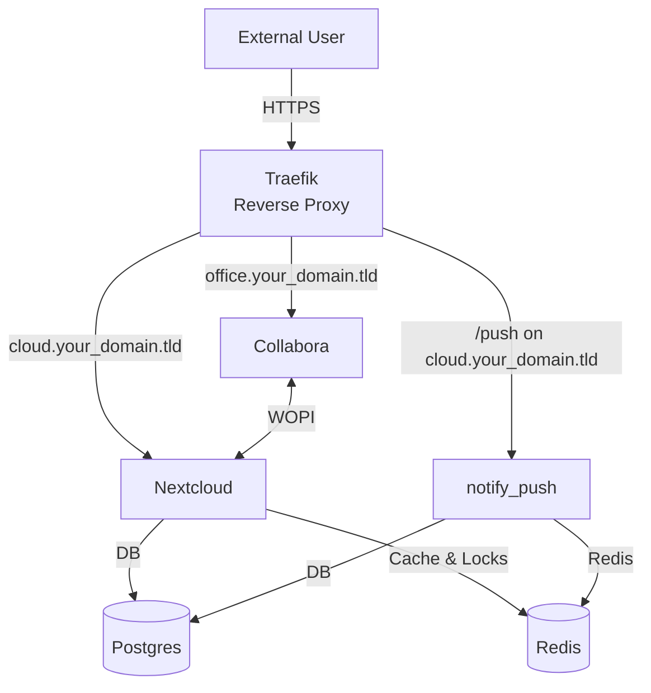

# Nextcloud with Collabora, Redis, notify_push and Traefik

This repository contains a Docker Compose configuration that deploys a self-hosted **Nextcloud** instance together with its supporting services:

* **Traefik** – reverse proxy & Let’s Encrypt certificates  
* **Postgres** – relational database  
* **Collabora Online** – in-browser office suite  
* **Redis** – in-memory cache & file-locking backend for Nextcloud  
* **notify_push** – real-time push-notification server for Nextcloud clients  

---

## Repository Structure and Service Overview

### Docker Compose File

The core of this deployment is the `docker-compose.yaml` file, which defines:

| Service | Purpose | Notes |
|---------|---------|-------|
| Traefik | Reverse proxy, TLS termination, automatic routing | Dashboard on :8080, ACME for Let’s Encrypt |
| Postgres | Persistent database for Nextcloud | Data volume `/data/postgres` |
| Nextcloud | Main application | Connects to Postgres & Redis |
| Collabora Online | Collaborative document editing | Routed via `office.your_domain.tld` |
| **Redis** | Memory-cache & file-locking for Nextcloud | Lightweight `redis:alpine`, append-only persistence, internal-only |
| **notify_push** | WebSocket push server for Nextcloud | Listens on `/push`, requires Redis & DB access |

---

## System Architecture Diagram



*Figure 1 – Traefik routes requests to the appropriate backend. Redis and notify_push enhance performance and real-time responsiveness.*

---

## How Traefik Works in This Setup
*(unchanged content kept)*

---

## Customization and Usage
*(unchanged intro paragraph)*

### Persistent Storage

Make sure volumes are mapped to durable storage on the host:

* `/data/traefik` – ACME certificates  
* `/data/postgres` – Postgres data  
* `/data/nextcloud` – Nextcloud files & config  
* `/data/redis` – **Redis AOF** persistence (new)  
* notify_push re-uses the Nextcloud volume in **read-only** mode, no extra volume required.

---

## Post-installation: notify_push

1. **Register the push endpoint**  
   After the stack is running, execute inside the Nextcloud container:

   ```bash
   docker exec -u www-data nextcloud php occ notify_push:setup https://cloud.your_domain.tld/push
   ```

2. **Verify**  
   ```bash
   docker exec -u www-data nextcloud php occ notify_push:status
   curl -I https://cloud.your_domain.tld/push
   ```
   Logs in the `notify_push` container should show successful connections.

3. **Troubleshooting**  
   * Ensure the `NEXTCLOUD_TRUSTED_DOMAINS` variable includes your domain.  
   * Check that Redis is reachable from notify_push (`ping` command inside container).  
   * Confirm Traefik route `Host(... ) && PathPrefix("/push")` returns `200`.

---

## Nextcloud Configuration
*(screenshots & instructions preserved)*

---

## Conclusion
This setup delivers a full-featured, performant Nextcloud deployment: Redis reduces database load and guarantees safe file locks, while notify_push gives instant updates to desktop & mobile clients.

---

## TODO
* write an env file … *(existing list intact)*

---

## References

* [Docker Compose for Nextcloud + Collabora + Traefik?](https://help.nextcloud.com/t/docker-compose-for-nextcloud-collabora-traefik/127733/6)
* [Docker compose – Collabora – Traefik](https://help.nextcloud.com/t/docker-compose-collabora-traefik/219975)
* **How to docker-compose with notify_push (2024)** – <https://help.nextcloud.com/t/how-to-docker-compose-with-notify_push-2024/186721>
