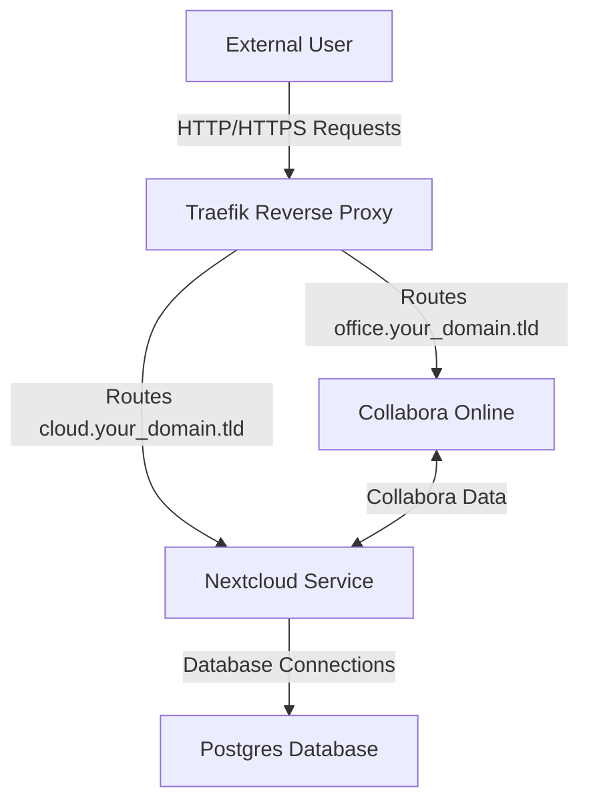
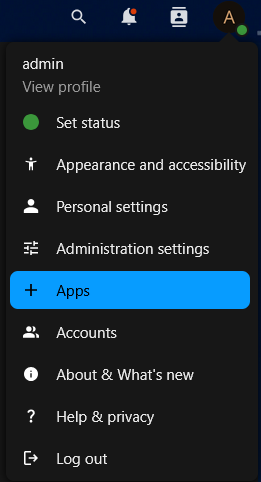
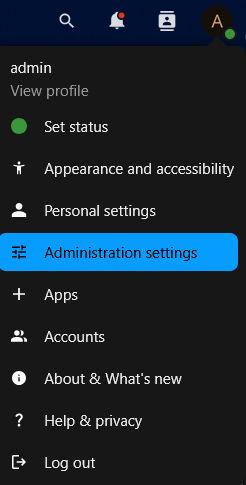
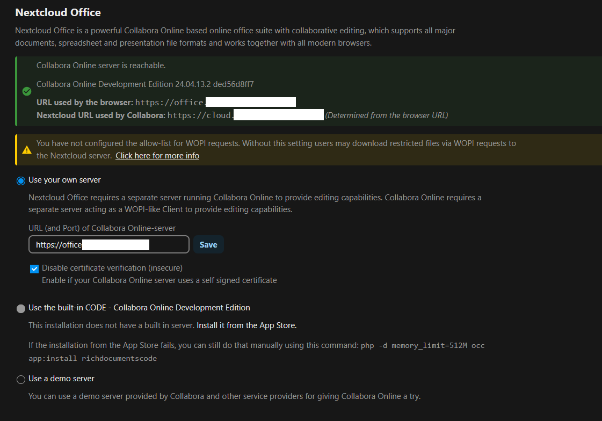

# Nextcloud with Collabora and Traefik

This repository contains a Docker Compose configuration that deploys a self-hosted Nextcloud instance along with its supporting services. Nextcloud is an open-source cloud storage and collaboration platform that lets you host your own file sharing and productivity environment. In this setup, Nextcloud is paired with:

- **Postgres:** A robust relational database used by Nextcloud for storing its data.
- **Collabora Online:** An integrated office suite that allows collaborative document editing.
- **Traefik:** A modern reverse proxy that automatically routes incoming HTTP/HTTPS requests to the correct container and handles SSL termination using Let's Encrypt.

---

## Repository Structure and Service Overview

### Docker Compose File

The core of this deployment is the `docker-compose.yaml` file, which defines the following services:

- **Traefik:**  
  - Acts as the reverse proxy.
  - Listens on ports 80 (HTTP), 443 (HTTPS), and 8080 (dashboard).
  - Automatically manages SSL certificates via the ACME protocol.
  - Dynamically routes requests to Nextcloud or Collabora based on host rules defined in container labels.
  - Uses Docker labels to secure and customize routes (e.g., enabling HTTP-to-HTTPS redirection and setting security headers).

- **Postgres:**  
  - Provides a persistent relational database for Nextcloud.
  - Is configured through environment variables (database name, user, and password).
  - Uses a dedicated volume to persist data.

- **Nextcloud:**  
  - The main application offering file sharing, syncing, and collaboration.
  - Connects to the Postgres service to store its data.
  - Is secured behind Traefik; its labels instruct Traefik to route traffic directed at `cloud.your_domain.tld` to this service.
  - Uses additional middleware (e.g., for proper handling of WebDAV and secure headers).

- **Collabora Online:**  
  - Enables online document editing, integrated with Nextcloud.
  - Is accessible through Traefik with its own host rule (`office.your_domain.tld`).
  - Uses environment variables to integrate with Nextcloud and configure language dictionaries.
  - Runs on a specific port (9980) that Traefik routes to via container labels.

---

## System Architecture Diagram

Below is a Mermaid diagram that illustrates the overall architecture and service interactions:



*Figure: Architecture Diagram – Traefik routes incoming requests to Nextcloud and Collabora, while Nextcloud uses Postgres for data storage.*

---

## How Traefik Works in This Setup

Traefik is a dynamic reverse proxy designed to work seamlessly with Docker. Here’s how it functions in this deployment:

- **Dynamic Configuration:**  
  Traefik monitors Docker containers for specific labels. In this configuration, both Nextcloud and Collabora containers include Traefik labels that define:
  - **Routing Rules:** Which hostnames (e.g., `cloud.your_domain.tld` for Nextcloud and `office.your_domain.tld` for Collabora) should be routed to each service.
  - **TLS Settings:** Enabling HTTPS and specifying certificate resolvers to automatically request SSL certificates from Let's Encrypt.
  - **Middleware:** Additional settings such as redirections, custom headers, and security policies.

- **SSL Termination:**  
  Traefik listens on port 80 and redirects traffic to HTTPS on port 443. It uses the ACME protocol (configured via command-line arguments) to obtain and renew SSL certificates automatically.

- **Dashboard and Logging:**  
  Traefik provides an administrative dashboard on port 8080. In this setup, access to the dashboard is secured with basic authentication. Logging and access logs are configured to help in monitoring and troubleshooting.

- **Integration via Docker Socket:**  
  By mounting the Docker socket, Traefik is able to detect and adapt to changes in container state automatically, without requiring manual configuration changes.

In summary, Traefik simplifies routing and security for the Nextcloud and Collabora services by automating SSL certificate management and dynamically adapting to container changes—all defined directly in the Docker Compose file.

---

## Customization and Usage

- **Service Modifications:**  
  You can extend or modify the services as needed (e.g., updating images, adding new environment variables, or integrating additional middlewares).

- **Persistent Storage:**  
  Make sure the volumes defined for Traefik (`/data/traefik`), Postgres (`/data/postgres`), and Nextcloud (`/data/nextcloud`) are configured for persistent storage on your host.

- **Environment Settings:**  
  Adjust time zones, credentials, and trusted domains in the environment variables for each service to match your setup.

- **Security Considerations:**  
  The Traefik dashboard is protected via basic authentication. Ensure that you update these credentials and review other security settings to maintain a secure deployment.

---

## Nextcloud configuration

If you used the original docker compose configuration, you will find your *Nextcloud* install on [nextcloud](https://cloud.your_domain.tld/), if necessary, first add an admin account and password.

Next, install *Nextcloud Office*, click on *Apps*

 

to open the *Discover Apps* page, search for *NextCloud Office* and install. Next, goto the *Administrator Settings*



and configure *Nextcloud Office* as follows:



---

## Configuration

Traefik has several configuration options, in this project we opted for static configuration files for all Traefik configuration parameters that you probably do not have to change to get this project up and running and Traefik environment variables that you have to configure to get started.

The static Traefik configuration file [traefik.yaml](./traefik.yaml) contains settings like enabling the Traefik dashboard, entrypoints, log level, etc. Its certificate resolver, however, is only partially configured, the ACME email address is missing. You can configure the ACME email address in the [traefik.env](./traefik.env) file, i.e. `TRAEFIK_CERTIFICATESRESOLVERS_MYRESOLVER_ACME_EMAIL`. Similar for the Traefik dashboard admin user name and password.

The [.env](./.env) file contains all other configuration variables.

To resume:

- set non-Traefik environment variables in [.env](./env)
- set Traefik environment variables in [traefik.env](./traefik.env)
- if necessary edit [traefik.yaml](./traefik.yaml)
- if necessary add dynamic Traefik configuration variables in [traefik_dynamic.yaml](./traefik_dynamic.yaml)
  
It is probably a good idea to keep your env variables in different env files depending on the environment, for example `.env_dev` for your non-Traefik environment variables and `traefik.env_dev` for your Traefik environment variables in development and to add those files to [.gitignore](./.gitignore).

## Building

Before building the containers, update the values in environment file [.env](./.env). If you'd like to use your own *.env* file, do not forget to rename it to *.env*.

Build and start the containers with:

```bash
source .env
docker compose up
```

or build and start the containers in the background with:

```bash
docker compose up -d
```

On Linux or WSL you can open the Traefik dashboard on [localhost:8080](http://localhost:8080/dashboard/) or use the office.your_domain.tld or cloud.your_domain.tld hostnames to access *Nextcloud* or *Collabora*.

---

## Conclusion

This repository provides an out-of-the-box solution for deploying Nextcloud with an integrated office suite (Collabora) and a robust reverse proxy (Traefik) that manages secure connections and dynamic routing. The Docker Compose file is designed to streamline the setup process while ensuring that each component is properly isolated, secure, and easily extendable.

## TODO

- env_file per service?
- make the install more robust with
  - an external and properly managed PostgreSQL instance
  - several container instances

## References

- [Docker Compose for Nextcloud + Collabora + Traefik?](https://help.nextcloud.com/t/docker-compose-for-nextcloud-collabora-traefik/127733/6)
- [Docker compose - Collabora - Traefik](https://help.nextcloud.com/t/docker-compose-collabora-traefik/219975)
- [Traefik documentation](https://doc.traefik.io/traefik/)